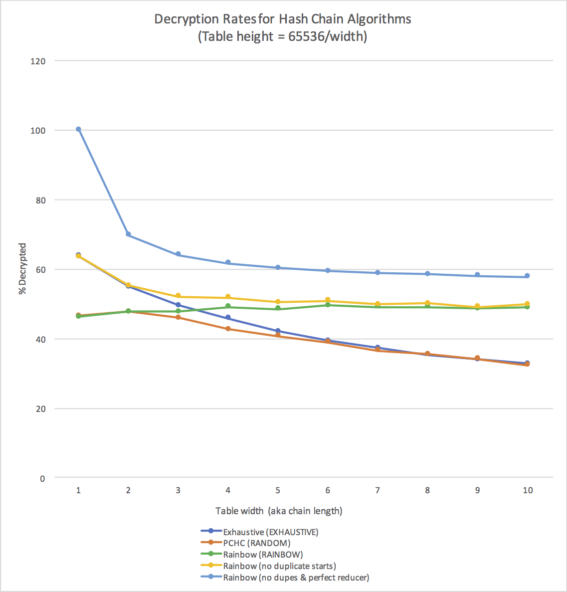

<style>
  strong {
    font-size: larger;
    font-variant: small-caps;
    font-weight: bold;
  }
  table {
    border: solid 1px grey;
    border-collapse: collapse;
    border-spacing: 0;
  }
  table thead th {
    background-color: grey;
    border: solid 1px grey;
    color: white;
    padding: 10px;
    text-align: left;
  }
  table tbody td {
    border: solid 1px grey;
    color: #333;
    padding: 10px;
    text-shadow: 1px 1px 1px #fff;
  }
  blockquote {
    margin-left: 2em;
    margin-right: 2em;
  }
  .red {
	color: red;
  }
  .blue {
	color: blue;
  }
  hr.style12 {
	height: 6px;
	background: url(../../images/hr-12.png) repeat-x 0 0;
    border: 0;
  }
  b {
    font-family: sans-serif;
	font-weight: 900;
  }
  .center {
	margin: auto;
	width: 100%;
	text-align: center;
  }
</style>

**Due Sunday, October 13 by 11:59pm**

In this assignment, we will explore the space-time tradeoffs of some data structures used to crack passwords.

Because stolen password databases are a real problem, most reasonably secure password database implementations do not store passwords in plaintext form.

An encrypted password database has the following form:

```
username_1,pwhash_1
username_2,pwhash_2
...
username_n,pwhash_n
```

In this assignment, assume that a username is an alphanumeric string, and that a password plaintext is an uppercase string _exactly_ 4 characters long composed of the following characters: `0-9`, `A-F`. Since we are exploring the scenario where you possess a stolen password database, you will have direct access to the database file.

Your task is to explore several schemes used to recover passwords from password databases, a process often referred to as _password cracking_.

This assignment is split into two parts. In part #1, you will implement and generate a cracked password dictionary. In part #2, you will implement and generate several variations on precomputed hash tables, including rainbow tables. In both parts, you will be attempting to recover plaintext passwords from an encrypted password database.

<hr style="border-color: purple;" />

## Requirements:

_Language_. You should write these programs using Java. Please only use the built-in Java libraries (do not use any additional JARs). If you are at all uncertain about which libraries are OK and which are not, please ask me.

_Common environment_. If you wish, you may develop this code on your own machine, but please be sure to test it in your class virtual machine before submitting.  All assignments will be graded using the class VM.

_Stack Overflow_. You are permitted to refer to Stack Overflow for help, but you _must not under any circumstances copy the code you see there_.  If you find a helpful Stack Overflow post, you must attribute the source of your inspiration in a comment at the appropriate location of your code, and you must provide a URL for me to look at.  Unattributed code will be considered an honor code violation.

_Instructions for Compiling and Running_. You must supply a file called `BUILDING.md` with your submission explaining how to:

1. compile your program using `javac`, and
2. how to run your program on the command line.

_Reflection questions_. This assignment asks you to answer a few questions. You must supply the answers to these questions in a `PROBLEMS.md` file.

_Starter code_. There is no starter code for this assignment. However, you will be given access to a [reference implementation](http://bree.ettinsmoor.net:8080/rainbowgen_2.12-0.1.0-SNAPSHOT) of a precomputed hash table generator / rainbow table generator. You will also be given a zipped, encrypted database, `encrypted_db.txt`.

<hr style="border-color: purple;" />

## Inputs and Outputs

The file, `encrypted_db.txt`, is a password database of the following form:

```
username_1,pwhash_1
username_2,pwhash_2
...
username_n,pwhash_n
```

where `username_i` is an alphanumeric user name, and where `pwhash_i` is a 32 digit hexadecimal number (i.e., 16 bytes), representing a password hash. Passwords are hashed using the [MD5 cryptographic hash algorithm](https://en.wikipedia.org/wiki/MD5). Password plaintexts, which are not stored in the password database, are composed of the following characters: `0`-`9` and `A`-`F`, and are _exactly 4 characters long_.  This file is the input to your program.

In both parts 1 and 2, you will be decrypting this database.  Your goal in both cases is to produce as output a "cracked" password database of the form:

```
username_1,password_1
username_2,password_2
...
username_n,password_n
```

Your decrypted database must be _sorted by username_.

To ensure that your code is working correctly, here are some sample plaintext passwords for a few users in the dictionary:

```
dbarowy,BA1D
ihowley,F00D
wjannen,CAFE
```

<hr style="border-color: purple;" />

## Part 1: Dictionary Attack

In part 1, your job is to crack the `encrypted_db.txt` database using a dictionary attack.  You should be able to call your program from the command line like:

```
java DictAttack <path to password database file> <output>
```

Your code should have a `DictAttack` class containing a `main` method.  `<output>` is the name of the file to write the decrypted database to.

You may want to refer to the readings [Why Stolen Password Databases are a Problem](https://williams-cs.github.io/cs331-f19-www/assets/misc/password_databases.html) and [Trading Time for Space](https://williams-cs.github.io/cs331-f19-www/assets/misc/trading_time_for_space.html).

<hr class="style12" />

### Plaintext generator

First, a dictionary attack needs a way of generating all possible plaintexts. You must implement a function with the following signature:

```
public static String genPlaintext(int num)
```

where `num` is a number between `0` and `65535`, and where the return value is a 4-character plaintext using the set of characters described above (see "Inputs and Outputs"). You may implement this function any way you want, but you need to be sure that the function is capable of generating all possible plaintexts using our scheme. One such scheme might produce a mapping from inputs to outputs like so:

    0       0000
    1       0001
    2       0002
    ...
    331     014B
    ...
    65535   FFFF

Note that the set of valid password plaintext characters just happens to be the same set of characters used when printing a number in [hexadecimal format](https://en.wikipedia.org/wiki/Hexadecimal).  In fact, if you look carefully at the sample mapping above, a simple algorithm to produce it should suggest itself.

<hr class="style12" />

### Cipher function

A dictionary attack must be able to hash plaintexts. We will be using the MD5 cryptographic hash function for this purpose. Every modern version of Java ships with an MD5 implementation in the [`java.security.MessageDigest`](https://docs.oracle.com/javase/8/docs/api/java/security/MessageDigest.html) library. Write a helper function with the following signature:

```
public byte[] hash(string password)
```

where `password` is the plaintext password string, and where the return value is a 16-byte MD5 hash.

Note that the javadoc for `MessageDigest` itself provides little guidance on how to use the library.  The basic idea is as follows:

```
String plaintext = "a plaintext";
byte[] ptBytes = plaintext.getBytes();
MessageDigest md5 = MessageDigest.getInstance("MD5");
byte[] cipherBytes = md5.digest(ptBytes);
```

A "digest" is another name for a ciphertext in the context of hash algorithms.

Note that setting up an `md5` instance every time you need to hash something is expensive, so you should only set it up once.  Consider adding a `MessageDigest md5` field to your `DictAttack` class.

<hr class="style12" />

### Database reader

A dictionary attack must also be able to read in the password database. You should write a method with the following signature:

```
public static String[][] readPasswords(string filename)
```

where `filename` is the path to the password dictionary database and where the returned two dimensional array represents the parsed password database as a table:

|index|username|password hash|
|-----|--------|-------------|
|`0`|`username`\\(_0\\)|`password_hash`\\(_0\\)|
|`1`|`username`\\(_1\\)|`password_hash`\\(_1\\)|
|\\(\ldots\\)|\\(\ldots\\)|\\(\ldots\\)|
|n-1|`username`\\(_{n-1}\\)|`password_hash`\\(_{n-1}\\)|

For example, if your returned password database is called `db`, you should be able to access the 7th username's password hash by calling `db[6][1]`.

<hr class="style12" />

### Cracking algorithm

Your main method must systematically call `genPlaintext` and, for each plaintext generated, it should call your `hash` method to generate a ciphertext. Each pair of plaintexts and ciphertexts should be stored in a data structure (a dictionary) that supports fast lookups. You will need to be able to perform lookups by the cryptographic hash (i.e., the hash should be the key). I suggest using Java's [`HashMap`](https://docs.oracle.com/javase/8/docs/api/java/util/HashMap.html) implementation, but you are free to choose any data structure that you think is appropriate.

<hr class="style12" />

### Generating a cracked password database

Finally, for each user in the parsed password database, you should use your dictionary to decrypt and print out cracked passwords. For each printed cracked password, please adhere strictly to the following format:

    username,password

For example,

    dbarowy,BA1D
    ihowley,F00D
    wjannen,CAFE

Your dictionary implementation should be able to decrypt all of the hashed passwords in the given password database, as well as any other possible database using the same scheme. Note that you should expect to encounter some passwords that generate the same MD5 hash (i.e., hash collisions). Since you will only store a single plaintext password from a set of equivalent passwords, it is fine to choose one arbitrarily.

For full credit, your decrypted dictionary should be _in sorted order_.

<hr class="style12" />

## Part 2: Trading Time for Space

Dictionary attacks are an effective tool when time and space are not an issue (e.g., you are a  government-level attacker who can devote supercomputing resources to solving the problem). Unfortunately, distributing dictionaries can be cost-prohibitive even for password schemes with only modest complexity. Precomputed hash chains and rainbow tables address this problem, by trading extra time to perform a lookup for reduced space used by the data structure.

Your implementation should be callable on the command line like so:

```
java HashChain <path to password database file> <output> <table type> <table width> <table height>
```

where `<table type>` is `exhaustive`, `random`, or `rainbow`; `<table width>` is the width of the hash chain table (in other words, the length of the hash chain); and `<table height>` is the number of hash chains generated.  `<output>` is the name of the file to write the decrypted database to.

Your code should have a `HashChain` class that contains a `main` method.

See the class handout [Trading Time for Space](https://williams-cs.github.io/cs331-f19-www/assets/misc/trading_time_for_space.html) to understand how precomputed hash chains work.

<hr class="style12" />

### Reduction function

An attack using precomputed hash chains requires a so-called _reducer_, a function that maps ciphertexts to plaintexts. Note that a reducer does not compute the hash inverse; in general, computing hash inverses is infeasible. Instead, the purpose of a reducer is to select a new plaintext so that hashes can be "chained" together.  Reducers are used as a kind of space-saving mechanism, allowing us to store only the _start point_ and _end point_ of a hash chain.

You must supply a method with the following signature:

```
public static String reduce(byte[] ciphertext, int index)
```

where `ciphertext` is the ciphertext to reduce and `index` is a number that selects a reduction function.  When you call `reduce`, it should return a plaintext.

There are many ways to reduce a ciphertext, but the most important criterion is that the reducer must be able to produce any possible plaintext given its input domain (all possible ciphertexts). For example, one such implementation might produce the following mapping from ciphertexts to plaintexts:

`reduce(AA338257F792484CAEB90FC3D8A708AF, 0)` \\(\rightarrow\\) `AA33`<br/>
`reduce(57BE0A3E4E7DF1C975A5B1FCAAB8CF6B, 0)` \\(\rightarrow\\) `57BE`<br/>
`reduce(C90874550C415765F8B15B45E4F64A9E, 0)` \\(\rightarrow\\) `C908`<br/>

Changing the index parameter might also produce the following outputs:

`reduce(AA338257F792484CAEB90FC3D8A708AF, 1)` \\(\rightarrow\\) `A338`<br/>
`reduce(57BE0A3E4E7DF1C975A5B1FCAAB8CF6B, 1)` \\(\rightarrow\\) `7BE0`<br/>
`reduce(C90874550C415765F8B15B45E4F64A9E, 1)` \\(\rightarrow\\) `9087`<br/>

<hr class="style12" />

### Precomputed hash chain table

In this part, you will generate a precomputed hash chain (PCHC) table.  To generate a PCHC table, you will need to reuse your `genPlaintext` function from Part 1. Write a table-generating function that has the following signature:

```
public T genTable(TableType tt, int width, int height)
```

where `T` is the dictionary datatype of your choosing, and `tt` is the following Java `enum`:

```
public enum TableType {
    EXHAUSTIVE,
    RANDOM,
    RAINBOW
}
```

Remember that a PCHC table maps plaintexts to plaintexts. Ciphertexts are not stored in the table at all.

As in part 1, I suggest using Java's `HashMap` for `T`; specifically, a `HashMap<string,string>`, where the key is a chain endpoint.  Note that using a `HashMap` for storing hash chains entails a tradeoff because `HashMap`s cannot store duplicate keys.  This means that you will not be able to store more than one chain with the same endpoint ("merged" chains), and must discard some chains.  Therefore your decryption rates will be lower than if you used a data structure that did not discard chains.  For the purposes of this assignment, a `HashMap` is fine, but if you want an extra challenge, try designing an alternative data structure.

You must be able to generate the following table types:

* EXHAUSTIVE: generate a PCHC table of size `width` \\(\times\\) `height` by systematically enumerating all possible plaintexts. If `width` \\(\times\\) `height` \\(<\\) \\(\lvert P \rvert\\), where \\(P\\) is the set of all possible plaintexts, then just enumerate the first `width` \\(\times\\) `height` passwords.
* RANDOM: generate a PCHC table of size `width` \\(\times\\) `height` by randomly selecting plaintexts.
* RAINBOW: generate a rainbow table of size `width` \\(\times\\) `height` by randomly selecting plaintexts.

Note that the only difference between an ordinary precomputed hash chain table and a rainbow table is how reducers are applied. In an ordinary table, you apply a fixed reducer (e.g., `reduce(hash, 0)`) at every step in a chain, whereas in a rainbow table, you apply a _different reducer for every reduction step in a chain_. For example, the first reduction might be called with `reduce(hash_0, 0)`, the second reduction might be called with `reduce(hash_1, 1)`, the third reduction might be called with `reduce(hash_2, 2)`, and so on, up to the width of the table.

<hr class="style12" />

### Table lookups

To lookup a decryption, you will need to supply the following lookup function:

```
public String lookup(byte[] c, T table, TableType tt, int width, int height)
```

where `c` is a ciphertext, `table` is your table of precomputed hash chains, `tt` is the table type, `width` is the table width (or chain length), and `height` is the table height (or number of chains).

The algorithm for performing a PCHC lookup is discussed in the [Trading Time for Space](https://williams-cs.github.io/cs331-f19-www/assets/misc/trading_time_for_space.html) handout. Note that lookups for rainbow tables work differently than for vanilla PCHC tables, because searching a chain for a ciphertext involves not just hashing and reducing, but hashing and reducing using the same sequence of reductions used to originally construct the table. If this does not make sense to you, I strongly recommend simulating a rainbow table lookup on paper (perhaps with some help from the [reference implementation](http://bree.ettinsmoor.net:8080/rainbowgen_2.12-0.1.0-SNAPSHOT)) until you see why.

<hr class="style12" />

### Generating a cracked password database

Finally, your `main` method should read the password database (reusing your `readPasswords` function from part 1), generate a table of the requested type (using `genTable`), and then should attempt to decrypt all of the password hashes stored in the database (using the `lookup` method), writing out the ones it can decrypt to a file. Your implementation should report the following two statistics:

* the number of hash chain collisions (i.e., the number of hash chains with the same endpoint), and
* the number of successful decryptions.

You should expect that your code will be tested against both the supplied database and a database of my choosing. Note that any technique based on precomputed hash chains is _unlikely to be 100% successful_ at decrypting all of the hashes, because collisions are hard to avoid. Nonetheless, if your lookup fails close to 100% of the time, something is wrong with your code.

The following chart, generated using my own code, should give you a sense of the kinds of decryption rates you can expect with a correct implementation.



<hr class="style12" />

### Reflection Questions

Provide answers to the following questions in a file called `PROBLEMS.md`.

1. The password scheme in Part 1 has 65,536 possible passwords. How many passwords would an _up-to-8 character_ alphanumeric (uppercase and lowercase) scheme have, assuming that the empty password is disallowed?  Explain your derivation.
1. Using your own implementation as a benchmark, how long do you estimate that it would take to generate a dictionary for the scheme in the previous question?
1. How many [mega/giga/tera/peta] bytes would it take to store a password dictionary for such a scheme assuming that password fields are always 8 bytes (where entries shorter than 8 bytes are NULL-padded) and where password hashes are 16 byte MD5 hashes? For simplicity, ignore the existence of hash collisions.
1. Given your answer to the previous question, what are the drawbacks when using your dictionary attack implementation for a password scheme like the one discussed in the previous questions? Think about the compute resources you actually used when performing your attack (CPU, RAM, disk; hint: where did you store data structures as you carried out your attack?). How might you modify your dictionary attack implementation to address the limitations you identify?
1. Why are we unable to decrypt all of the passwords in Part 2?  Do you think a different reducer would help?

<hr style="border-color: purple;" />

### Bonus

 Compute the success probability formula found at the top of page 6 in the paper [Making a Faster Cryptanalytic Time-Memory Trade-Off](https://williams-cs.github.io/cs331-f19-www/assets/readings/oechslin_03.pdf). What is the expected success probability for a table of width 16 and a height of 4096? Note that Oechslin states that the probability that any two plaintexts collide is \\(\frac{1}{m}\\), where \\(m\\) is the number of possible plaintexts, which assumes, somewhat optimistically, that both the hash function and reducer select values uniformly at random. The number of successes you observe will probably be lower. Estimate your hash collision probability empirically by generating a table of width 1 and a height of \\(m\\). How close is your implementation? Also note that Oechslin's notation is a little different than the notation we use in class.

<hr style="border-color: purple;" />

### Development Tips

This assignment may seem overwhelming; in actuality, like many real-world software artifacts, it merely contains a large number of small steps. Work systematically, finishing off each step, and you will successfully complete the entire assignment.

* The password scheme we are attacking has \\(16^4\\) possible passwords, which is a big-ish number. But none of the techniques above actually depend on that number. Do yourself a favor and work on a smaller instance of the problem. For example, you might define a constant `PWLEN` that says how long a password is, and during development, set `PWLEN = 1`. This will make testing much faster, since you can manually check by hand whether your code is doing the right thing.
* Ciphertexts are a Java `byte[]`, which is a little bit of a pain, since you can't print them directly during debugging. Do yourself a favor and define a "pretty print" function for ciphertexts so that you can print and read them. I like [base 16 encoding](https://en.wikipedia.org/wiki/Binary-to-text_encoding) for what I hope is an obvious reason.
* You should be able to simulate dictionary, precomputed hash chain, and rainbow table lookups on paper.  Be sure to work through each algorithm on paper _first_. If you are struggling with this part, I am happy to meet with you during office hours. Working with a friend on lookups is also an _excellent_ use of a study group, particularly since I think that performing a lookup on paper is _a fair question to ask on a midterm exam_ (HINT HINT HINT).
* Finally, it's not a bad idea to implement `genTable` and `lookup` first only for the `EXHAUSTIVE` scheme, then the `RANDOM` scheme, then finally the `RAINBOW` scheme. Each scheme adds a little bit of complexity, so you can rule out problems by building your tool end-to-end for the simplest scheme (`EXHAUSTIVE`) first.

<hr style="border-color: purple;" />

## Lab Deliverables

By the start of lab, you should see a new private repository called `cs331lab02_pwcrack-{USERNAME}` in your GitHub account (where `USERNAME` is replaced by your username).

For this lab, please submit the following: 

    cs331lab02_pwcrack-{USERNAME}/
        README.md
        BUILDING.md
        PROBLEMS.md
        encrypted_db.txt
        DictAttack.java
        HashChain.java

where the `DictAttack.java` and `HashChain.java` files contain your _well-documented_ source code.  You may also add additional class files if you need them.

It is always a good practice to create a small set of tests to facilitate development, and you are encouraged to do so here.

As in all labs, you will be graded on _design_, _documentation_, _style_, and _correctness_. Be sure to document your program with appropriate comments, including a general description at the top of the file, and a description of each function with pre- and post-conditions when appropriate. Also, use comments and descriptive variable names to clarify sections of the code which may not be clear to someone trying to understand it.

Whenever you see yourself duplicating functionality, consider moving that code to a helper function. There are several opportunities in this lab to simplify your code by using helper functions.

<hr style="border-color: purple;" />

## Submitting Your Lab

As you complete portions of this lab, you should `commit` your changes and `push` them. <u>Commit early and often.</u> When the deadline arrives, we will retrieve the latest version of your code. If you are confident that you are done, please use the phrase `"Lab Submission"` as the commit message for your final commit. If you later decide that you have more edits to make, it is OK. We will look at the latest commit before the deadline.

* <u>Be sure to push your changes to GitHub</u>.
* <u>Verify your changes on Github.</u> Navigate in your web browser to your private repository on GitHub. It should be available at [https://github.com/williams-cs/cs331lab02_pwcrack-{USERNAME}](https://github.com/williams-cs/cs331lab02_pwcrack-{USERNAME}). You should see all changes reflected in the files that you `push`. If not, go back and make sure you have both committed and pushed.

We will know that the files are yours because they are in _your_ `git` repository. <u>Do not include identifying information in the code that you submit.</u> We grade your lab programs anonymously to avoid bias. In your `README.md` file, please cite any sources of inspiration or collaboration (e.g., conversations with classmates). We take the honor code very seriously, and so should you. Please include the statement `"I am the sole author of the work in this repository."` in the comments at the top of your Java files. 

<hr style="border-color: purple;" />

## The squeaky wheel gets the grease

I am always looking to make my labs better.  For one bonus point, please submit answers to the following questions using the [anonymous feedback form](http://barowy.net/cs331f19/) for this class:

1. How difficult was this assignment on a scale from 1 to 5 (1 = super easy, ..., 5 = super hard)?
1. Did this assignment help you to understand password attacks?
1. If you had the opportunity to teach this material to someone else, what skill/technique would you emphasize?
1. Your name, for the bonus point (if you want it).

<hr style="border-color: purple;" />

## Bonus: Mistakes

Did you find any mistakes in this writeup?  If so, add a file called `MISTAKES.md` to your GitHub repository and describe the mistakes using bullets.  For example, you might write

    * Where it says "bypass the auxiliary sensor" you should have written "bypass the primary sensor".
	* You spelled "college" wrong ("collej").
	* A quadrilateral has four edges, not "too many to count" as you state.
	
You will receive one bonus point on this assignment for each mistake I am able to validate.

<hr style="border-color: purple;" />
