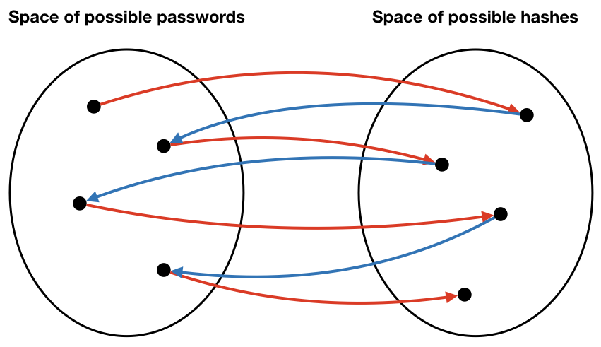
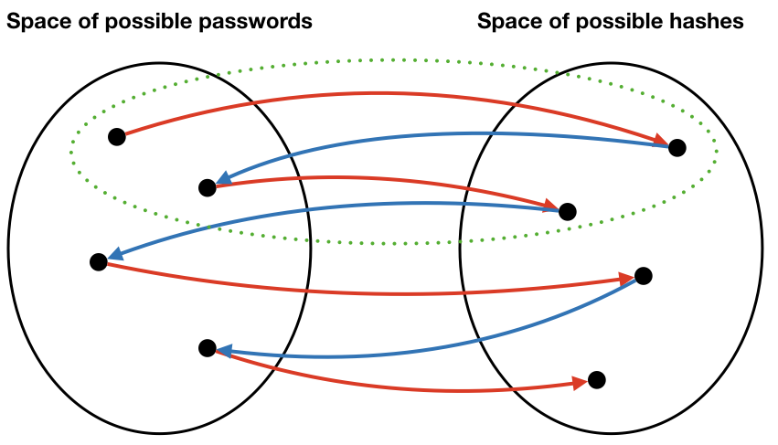
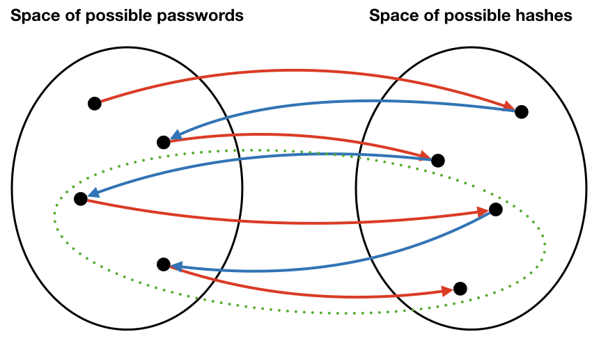

<style>
  strong {
    font-size: larger;
    font-variant: small-caps;
    font-weight: bold;
  }
  table {
    border: solid 1px grey;
    border-collapse: collapse;
    border-spacing: 0;
  }
  table thead th {
    background-color: grey;
    border: solid 1px grey;
    color: white;
    padding: 10px;
    text-align: left;
  }
  table tbody td {
    border: solid 1px grey;
    color: #333;
    padding: 10px;
    text-shadow: 1px 1px 1px #fff;
  }
  blockquote {
    margin-left: 2em;
    margin-right: 2em;
  }
  .red {
	color: red;
  }
  .blue {
	color: blue;
  }
  hr.style12 {
	height: 6px;
	background: url(../images/hr-12.png) repeat-x 0 0;
    border: 0;
  }
  b {
    font-family: sans-serif;
	font-weight: 900;
  }
  .center {
	margin: auto;
	width: 100%;
	text-align: center;
  }
</style>

A dictionary attack is a guaranteed method for cracking password databases.  The primary value is the fact that passwords can be precomputed, stored on disk, and distributed for later use.

However, dictionary attacks are very expensive, requiring resources beyond the capabilities of most potential attackers.  They take a long _time_ to do, and they require enormous _storage_ resources.  Because of the space constraints, even attackers who have these resources cannot easily share cracked databases.

This document describes an alternative attack that still requires large amounts of _time_, but allows attackers to share password databases in a _compressed form_ that uses less _space_, making sharing feasible.  Such compressed databases enable other attackers with fewer resources to crack passwords.  In the real world, such compressed cracked databases are [sometimes sold on the black market](https://haveibeenpwned.com/PwnedWebsites).

We assume the following:

* The attacker stole the password database.
* The database is encrypted using a cryptographic hash.
* The attacker knows the what cryptographic hash algorithm was used.

<hr style="border-color: purple;" />

## Dictionary Attack

In a dictionary attack, we are saving guessed passwords.

The form of a dictionary is the following:  
  
  \\(c_1,p_1\\)<br/>
  \\(c_2,p_2\\)<br/>
  \\(\ldots\\)<br/>
  \\(c_n,p_n\\)<br/>
  
  where \\(c_i\\) is a ciphertext and \\(p_i\\) is a plaintext.

How do we obtain a dictionary?  As long as we know the algorithm used to hash passwords, we can _compute_ a hash for any given plaintext password.  We usually obtain plaintext passwords by systematically enumerating them.  After hashing, pairs of plaintexts and hashes are stored a table, hash first, and in sorted order.  Later, when we need to "crack" a password found in a password database, all we need to do is find the password by looking up its hash in the table.

Although precomputation is quite expensive, the cost for a lookup is \\(O(\log n)\\), because we can do a binary search on a sorted password database.

There's a big tradeoff: we need to store all of those passwords.  For an 8-character password composed only of the 36 lowercase alphanumeric characters, there are \\(2.8 \times 10^{12}\\) possible passwords.  That corresponds to roughly 20 TB of data for a relatively weak password scheme!

Therefore, there are two problems:

* Databases are too big. Only determined attackers are likely to be willing to spend the resources to compute and store such a large database.
* Distributing such large databases is difficult.

Hopefully, this example helps you appreciate the importance of having long passwords drawn from a large set of possible characters.

<hr style="border-color: purple;" />

## A More Granular Space-Time Tradeoff: Precomputed Hash Chains

Before hash chains, if you wanted to crack a password database of size \\(n\\), for a password scheme having \\(m\\) possible passwords, you had two options:

1. Precompute all possible passwords hashes ahead of time (i.e., a dictionary attack)

	* I.e., definitely spend \\(O(m)\\) time and \\(O(m)\\) space to crack all possible passwords, in order to spend only \\(O(\log m)\\) time to retrieve one password, or
	* \\(O(n \log m)\\) time to retrieve a whole password database
	* But it's pretty hard to redistribute a database of \\(O(m)\\) size.

2. Or precompute nothing (i.e., brute force)
	
	* and spend \\(O(\frac{m}{2})\\) _average_ time per password, or
	* \\(O(\frac{nm}{2})\\) to crack all passwords

_Precomputed hash chains_ change the space calculus.

  * Original idea by Martin Hellman (one of the co-inventors of public key cryptography).
  * You still need to spend \\(O(m)\\) time to generate all possible password hashes,
  * but you can instead use \\(O(\frac{m}{k})\\) space, where \\(k\\) is a parameter of your choosing. \\(k\\) is called the _chain length_ for reasons you will see later.
  * The tradeoff is that you must spend a little bit more time, \\(O(k \cdot \log \frac{m}{k})\\) time, to "retrieve" the password for one hash, or
  * \\(O(nk \cdot \log \frac{m}{k})\\) time to retrieve passwords for all \\(n\\) hashes.
  
<hr class="style12" />
  
### Intuition

In short, the intuition is to store only \\(O(\frac{m}{k})\\) passwords. You store _no hashes_. The hashes and the passwords that are not stored can be generated again on the fly.
  
Let's look at a dictionary again:

  \\(c_1,p_1\\)<br/>
  \\(c_2,p_2\\)<br/>
  \\(\ldots\\)<br/>
  \\(c_n,p_n\\)<br/>

If \\(k = 4\\), then what we're saying is that we can somehow remove roughly three-quarters of the entries (technically, \\(\frac{2m}{k}\\)).  <b>How?</b>

<hr class="style12" />

#### Perfect reduction

Suppose we have the following ingredients:

1. \\(f(p) = c\\), a cipher that maps plaintexts to ciphertexts; in this case, a hash function.
	* Recall that because \\(f\\) is a hash function, there is no inverse function \\(f^{-1}(f(p)) = p\\).
1. We also have a function, \\(r(c) = p\\),  that maps cipertexts to plaintexts, called a _reducer_.
	* The reducer is __not the inverse of the hash__.  It is just a function that maps ciphertexts back to plaintexts.

As a thought experiment, suppose \\(r\\) were the following ideal function:

\\(r(c_i) = p_{i-1} \text{ if } i > 1 \text{ otherwise } p_m\\)
	   
where \\(i\\) ranges from \\(1\\) to \\(m\\).  Recall that \\(m\\) is the number of possible passwords.
	   
Then we can do the following interesting things:

* We can compute all of the hashes in our dictionary, starting from a single plaintext password, because we can _generate_ plaintexts as we go.
* Because hashes are derived from plaintexts, we don't actually need to store hashes.
* Because we can generate plaintexts, we _also do not need to store all of the plaintexts_!

To make this clear, let's look at an example.  Remember that our goal is to precompute hashes for all passwords.

Suppose we start with the plaintext password, \\(p_2\\).  Using the hash function, \\(f\\), \\(f(p_2) = c_2\\).  Now we know that \\(c_2\\) hashes to \\(p_2\\).  We save it in our database.

To continue our attack, we need another plaintext.  Although we could sample one randomly, the reducer, \\(r\\), can provide one.  That's its purpose.  \\(r(c_2) = p_1\\).  Hashing \\(p_1\\) yields \\(c_1\\).  Again, we save this pair in our datbase.

But notice there was an interesting phenomena at work here.  We can "get to" both \\(c_1\\) and \\(c_2\\) from \\(p_1\\) through repeated application of two functions, \\(f\\) and \\(r\\).  In fact, if you think carefully about our definitions of \\(f\\) and \\(r\\), you will see that we can generate _all_ passwords and hashes from just \\(p_1\\).

<hr class="style12" />

#### Hash chain

To be clear, from a given password, we can compute a _hash chain_ of the following form:
	   
\\(p_4 \rightarrow_h c_4 \rightarrow_r p_3 \rightarrow_h c_3 \rightarrow_r p_2 \rightarrow_h c_2 \rightarrow_r p_1 \rightarrow_h c_1\\)
	   
where \\(\rightarrow_h\\) denotes hashing and \\(\rightarrow_r\\) denotes reduction.
	   
The insight is that, not only do we not need to store the hashes \\(c_1\\) and \\(c_2\\), we don't need to store many passwords either.
	   
The following diagram shows an idealized relationship between passwords and hashes (notice that there are no collisions).  Also, note, this diagram is intended to convey the intuition, so it does not perfectly represent the problem.



<hr class="style12" />

#### Compressed password table
	   
Although we can generate all passwords and hashes from a single "seed" password in this example, it doesn't buy us anything special.  After all, if we spend \\(O(m)\\) time to generate a datastructure that later requires \\(O(m)\\) time for lookups, we have wasted our time.  The interesting part is when you "snip" hash chains.  For example, let's divide a chain into pieces of length 4, and only store the beginning and ending passwords for each piece.  This "snipping size" is the meaning of the parameter \\(k\\) that we described earlier.

|password|password|
|--------|--------|
|\\(p_4\\)|\\(p_1\\)|
|\\(p_8\\)|\\(p_4\\)|
|\\(p_{12}\\)|\\(p_8\\)|
|\\(\ldots\\)|\\(\dots\\)|
|\\(p_n\\)|\\(p_{n-3}\\)|

To be clear, each row consists of _only a pair of passwords_.  Nevertheless, we can reconstruct all of the missing passwords.

For example, although the first row contains neither \\(p_2\\) nor \\(p_3\\), we know that we can reproduce the missing pieces by computing the hash chain starting from \\(p_4\\).  For example, we can regenerate \\(p_3\\) by computing \\(r(f(p_4))\\).
      
For reasons you will see in a moment, let's store our smaller chains the other way around.  We will also keep them sorted by the password on the left side.  
  
|end point|start point|
|--------|--------|
|\\(p_1\\)|\\(p_4\\)|
|\\(p_4\\)|\\(p_8\\)|
|\\(p_8\\)|\\(p_{12}\\)|
|\\(\ldots\\)|\\(\dots\\)|
|\\(p_{n-3}\\)|\\(p_n\\)|

Let the keys on the left side be called _end points_ and the values on the right side be called _start points_.  As you will see, these names make sense because you can "get to" any of the end points by reducing and hashing values starting from the start points.

More generally, \\(k\\) is the length of the chain we want to "snip."  You may not realize it quite yet, but we've just created a password database that's much smaller while implicitly storing the same information.  This is true even though this data structure contains no hashes of any kind.

In the diagram below, suppose one of the hash chains in the table is the set of points inside the dashed green oval.  If we discover that a hash is in this chain, we only need to search inside this one chain.



Another chain is in the next diagram.  Notice that the two chains are non-overlapping.  Therefore, we really can limit our search for keys to just the one chain where we found it.



<hr class="style12" />

#### Use

The genius of this odd data structure starts to make sense once you use it.  Suppose we're looking for the plaintext for cipertext \\(c_5\\).  Refer to the table above.

1. First, we _reduce_ \\(c_5\\).  \\(r(c_5) = p_4\\).
1. We search the database (e.g., using binary search) for the _end point_ \\(p_4\\) and we find it.  It's in the second row of the table.
1. We then retrieve the _start point_ \\(p_8\\).
1. Hash \\(p_8\\).
  * Does \\(f(p_8) = c_5\\)?  No.
1. So we hash \\(p_8\\) to \\(c_8\\) and reduce to \\(p_7\\).
  * Does \\(f(p_7) = c_5\\)? No.
1. Hash \\(p_7\\) to \\(c_7\\) and reduce to \\(p_6\\).
  * Does \\(f(p_6) = c_5\\)? No.
1. Hash \\(p_6\\) to \\(c_6\\) and reduce to \\(p_5\\).
  * Does \\(f(p_5) = c_5\\)? No.
1. Hash \\(p_5\\) to \\(c_5\\) and reduce to \\(p_4\\).
  * Does \\(f(p_4) = c_5\\)? Yes.  So now we know that the password for \\(c_5\\) is \\(p_4\\).

To be clear, here's the algorithm:

Given a ciphertext \\(c_0\\), find the plaintext \\(p\\) such that \\(f(p) = c_0\\).

1. Let \\(c \leftarrow c_0\\).
1. Reduce \\(c\\): set \\(p \leftarrow r(c)\\).
2. If \\(p\\) is an end point in the database, go to 4. Otherwise, compute \\(c \leftarrow f(p)\\) then go to 2.
3. \\(p\\) is an end point.  Retrieve the start point \\(p'\\).
4. Let \\(c' \leftarrow f(p')\\).
5. Does \\(c' = c_0\\)? If yes, then \\(p'\\) is the password.  Return \\(p'\\).
7. Otherwise, let \\(p' \leftarrow r(c')\\) and go to 5.
8. If you never find a \\(c' = c_0\\), then the password is not in the database.
	      
A few more things to note:
	      
* \\(k\\) is a user parameter.  E.g., you can have a roughly tenfold reduction in the size of the database if you are willing to do up to tenfold more steps to lookup later.
* A chain divides up the search space of possible passwords.  Instead of searching blindly as in brute force, a chain dramatically narrows the search to just the entries in the chain.  We _know_ that the password we are looking for is in the chain.  Likewise, as chains get shorter, the data structure looks more and more like an ordinary password dictionary.  There isn't much searching involved, but we have to use more space.

<hr class="style12" />

#### Imperfect reduction

In the real world, we do not have perfect reducers like the kind described here.  The ideal reducer described above allows us to crack an entire password database because it provides a one-to-one correspondence between hashes and plaintext passwords, and it also allows us to cover the entire password space by repeated hashing and reduction.

Although it is possible that real reducers with the above properties exist, they are most definitely hard to find.  But, surprisingly, for this technique to be useful, it is not necessary to have a perfect reducer.  Imperfect reducers can often crack large proportions of password databases.

A good example of an imperfect reduction is to simply take the first few characters of a password hash as a password.  For example, given the password hash

```
AA338257F792484CAEB90FC3D8A708AF
```

we could apply a reduction that returns

```
AA33
```

This somewhat harebraned scheme is the one we use for our password cracking lab, and as you will see, it works shockingly well.  The reason is that an important design goal of a cryptographic hash function is to _uniformly distribute hash values_.  Therefore, if a reduction can be found that can convert uniformly-distributed hashes into uniformly-distributed plaintexts, a large proportion of the password space can be explored.

<hr style="border-color: purple;" />

## Hash collisions

Oddly, one "countermeasure" against precomputed hash chain attacks is to use a cryptographic hash function that has collisions.

Suppose that two passwords, \\(p_i\\) and \\(p_j\\), hash to the same ciphertext, \\(c\\).

\\(\ldots \rightarrow_r p_i \rightarrow_h c \rightarrow_r p_a \rightarrow_h c_a \rightarrow_r p_b \rightarrow_h c_b \rightarrow_r p_c \rightarrow_h c_c \ldots\\)

\\(\ldots \rightarrow_r p_j \rightarrow_h c \rightarrow_r p_a \rightarrow_h c_a \rightarrow_r p_b \rightarrow_h c_b \rightarrow_r p_c \rightarrow_h c_c \ldots\\)

Notice that after applying the reduction function to \\(c\\), the two chains are the same.  Because the two passwords share a ciphertext, their two chains "merge".  Since our algorithm assumes that chains never merge, we have to discard one of the branches of the chain in order to store it in our database.  We will lose the ability to decrypt any of the passwords in the discarded chain.  If \\(k\\), our chain length, is a large number, we will lose many passwords, and if \\(k\\) is small, we will lose fewer.

Although you might view hash collisions as a countermeasure against precomputed hash chain attacks, no crypto designer in their right mind would intentionally introduce design a hash function that produces collisions, since it also weakens other properties of cryptographic hashes.  Nonetheless, real cryptographic hash functions are guaranteed to collide (unless they are [perfect](https://en.wikipedia.org/wiki/Perfect_hash_function)), so hash chain attack implementations must deal with this contingency.

<hr style="border-color: purple;" />

## Rainbow Tables

A _rainbow table_ is a special kind of precomputed hash chain that is more robust&mdash;though not immune&mdash;to hash collisions.  The paper, [Making a Faster Cryptanalytic Time-Memory Trade-Off](https://williams-cs.github.io/cs331-f19-www/assets/readings/oechslin_03.pdf) by Philippe Oechslin, describes this improved design.
